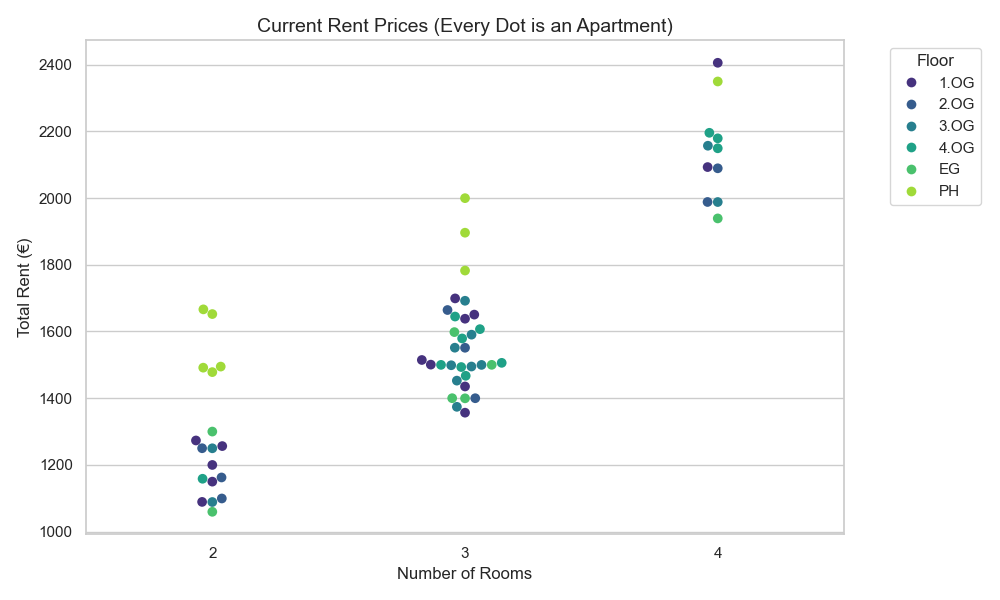

# 🏙️ Buwog Apartment Tracker & Market Analysis

> An automated ETL pipeline to track rent prices, occupancy rates, and market trends for the "Eutighofer Tor" development project.


## 📊 Project Overview

This tool monitors the housing market for specific real estate developments. It acts as a **Data Pipeline** that:
1.  **Extracts** data daily/weekly from the provider's public portal.
2.  **Transforms** unstructured HTML into structured historical datasets.
3.  **Loads** the data into a CSV-based time-series database.
4.  **Visualizes** trends in rent prices and occupancy using Seaborn & Matplotlib.
5.  **Reports** detailed changes (new rentals, price adjustments) compared to the previous run.

It is designed to run autonomously via Windows Task Scheduler or Cron.

### 📷 Dashboard Preview

*(Visualization of rent prices per room count, color-coded by floor level)*

## 🚀 Key Features

*   **Automated Data Collection:** Scrapes current listings without browser automation (using `requests` for reliability).
*   **Historical Tracking:** Appends new data to a persistent CSV history file, enabling trend analysis over time.
*   **Smart Visualization:**
    *   **Occupancy Trends:** Line charts showing available vs. rented units.
    *   **Price Discovery:** Swarm plots to identify individual listing prices.
    *   **Market Evolution:** Tracks average rent changes to detect price hikes.
*   **Robustness:** Handles missing data, different room categories, and network errors gracefully.

## 🛠️ Installation

1.  **Clone the repository**
    ```bash
    git clone https://github.com/YOUR_USERNAME/buwog-apartment-tracker.git
    cd buwog-apartment-tracker
    ```

2.  **Set up the Virtual Environment**
    ```bash
    python -m venv venv
    # Windows:
    .\venv\Scripts\activate
    # Mac/Linux:
    source venv/bin/activate
    ```

3.  **Install Dependencies**
    ```bash
    pip install -r requirements.txt
    ```

## 💻 Usage

### Manual Run
To trigger an immediate update of the data and plots:
```bash
python src/scraper.py
python src/visualizer.py
python src/reporter.py
```

## Automation (Windows)

The project includes a `run_weekly_template.bat` file.

1. Edit the file to match your project path.
2. Set up Windows Task Scheduler to run this batch file weekly.
3. Ensure "Run whether user is logged on or not" is checked for background execution.

## 📂 Project Structure
```text
buwog-apartment-tracker/
├── assets/              # Images for README
├── data/                # CSV Data storage (Time-series)
├── plots/               # Generated visualization images (Trends)
├── reports/             # Generated report tables (Weekly changes)
├── src/                 
│   ├── scraper.py       # ETL Logic (Extract & Transform)
│   ├── visualizer.py    # Data Analysis & Plotting
│   └── reporter.py      # Detailed Change Detection Logic
├── .gitignore           
├── requirements.txt     # Python dependencies
└── README.md            
```
## ⚖️ Disclaimer
This tool is for educational and personal analysis purposes only. It accesses publicly available data. The frequency of requests is minimal (once per week) to ensure no load is placed on the host servers.
